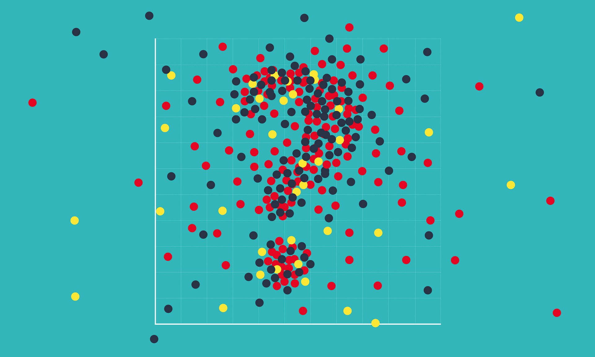

> You must unlearn what you have learned.

Quote from Yoda, The Empire Strikes Back

---
## Activity 00 - Markdown
This document is a simple example to:
1. Demonstrate what a .pdf document looks like when viewed in GitHub, and
2. Provide you with an opportunity to test your Markdown skills!

### Some generic image

Figure 1: Scatterplot comprised of red, yellow, and black points with a hidden question mark
Your image might not have a Figure number when you Preview it because of how link information displays
in Markdown documents.

This image:
* Has a teal background.
* Has red, yellow, and black points.
* Has a “hidden” **question mark**.
* Was obtained from [blogspot](https://www.convodinners.com/musings/2018/1/28/how-statistics-lost-their-power-and-why-we-should-fear-what-comes-next)

## Do This For A Section Heading
### Do Not Do This For A Section Heading 
Verify that this is on a new line.

